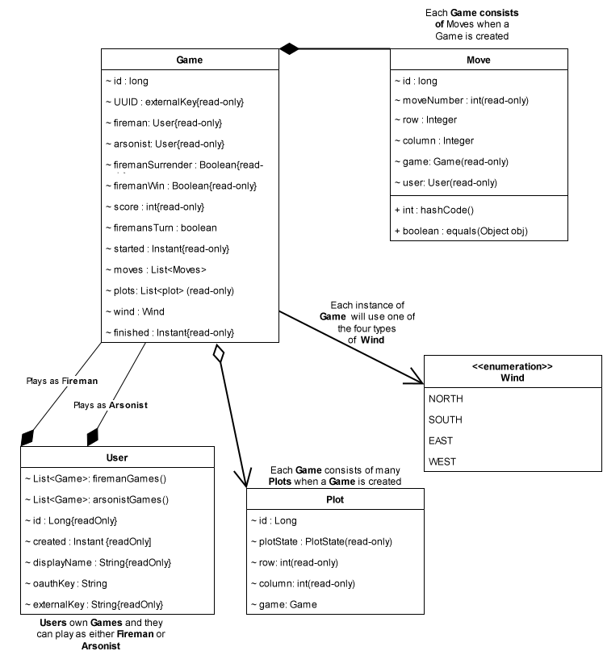



## Page contents
{:.no_toc:}

- ToC
{:toc}

## UML class diagram

---

## ERD class diagram

---

## Entity Classes

- [Game](https://github.com/ddc-java-19/fireman/blob/main/server/src/main/java/edu/cnm/deepdive/fireman/model/entity/Game.java)

- [Move](https://github.com/ddc-java-19/fireman/blob/main/server/src/main/java/edu/cnm/deepdive/fireman/model/entity/Move.java)

- [Plot](https://github.com/ddc-java-19/fireman/blob/main/server/src/main/java/edu/cnm/deepdive/fireman/model/entity/Plot.java)

- [User](https://github.com/ddc-java-19/fireman/blob/main/server/src/main/java/edu/cnm/deepdive/fireman/model/entity/User.java)

---

## Data Definition Language (DDL)

